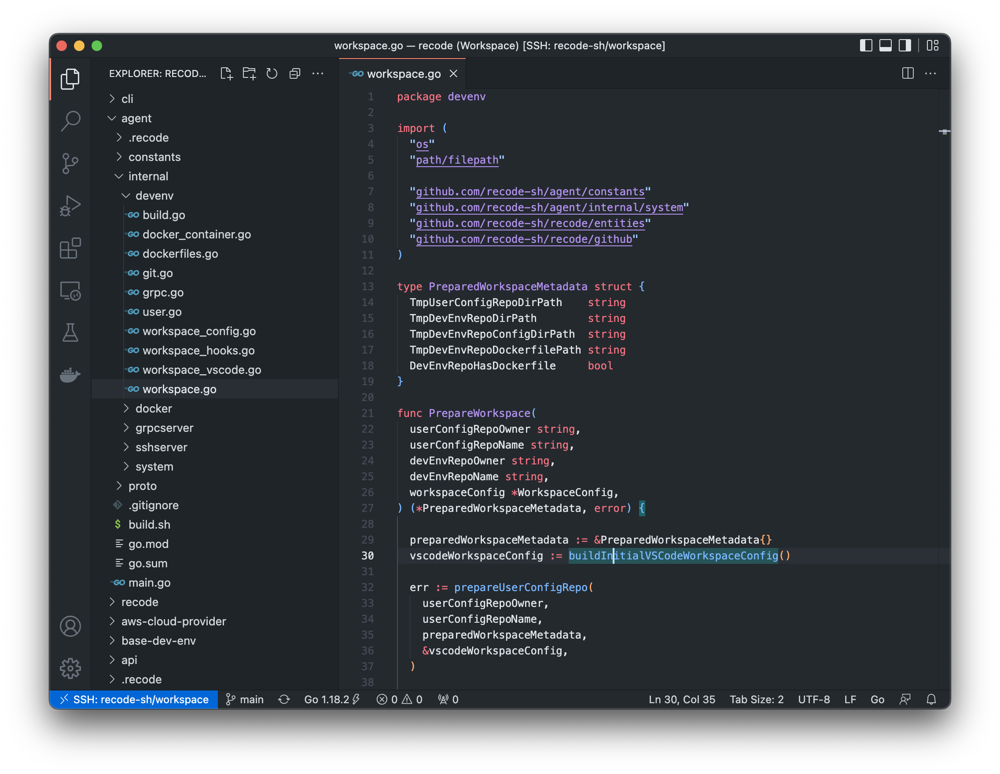
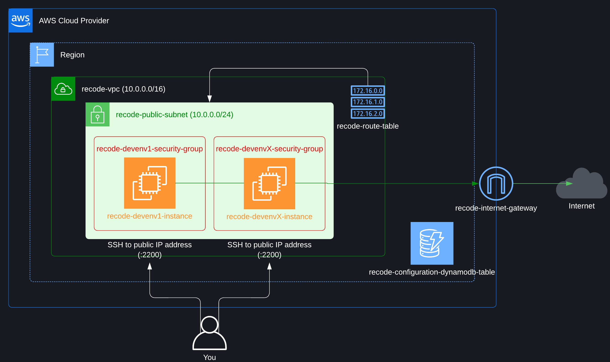

<p align="center">
  
</p>

<p align="center">
    <h1 align="center">AWS Cloud Provider</h1>
    <p align="center">This repository contains the source code that implements the AWS cloud provider for the <a href="https://github.com/recode-sh/cli">Recode CLI</a>.</p>
</p>

```bash
recode aws start --region eu-west-3 recode-sh/workspace --instance-type t2.medium
```




## Table of contents
- [Usage](#usage)
    - [Authentication](#authentication)
        - [--profile](#--profile)
        - [--region](#--region)
    - [Permissions](#permissions)
    - [Authorized instance types](#authorized-instance-types)
- [Infrastructure lifecycle](#infrastructure-lifecycle)
    - [Start](#start)
    - [Stop](#stop)
    - [Remove](#remove)
    - [Uninstall](#uninstall)
- [Infrastructure costs](#infrastructure-costs)
- [The future](#the-future)
- [License](#license)

## Usage

```console
To begin, create your first development environment using the command:

    recode aws start <repository>

Once started, you could stop it at any time, to save costs, using the command: 

    recode aws stop <repository>

If you don't plan to use this development environment again, you could remove it using the command:
    
    recode aws remove <repository>
    
<repository> may be relative to your personal GitHub account (eg: cli) or fully qualified (eg: my-organization/api).

Usage:
  recode aws [command]

Examples:
  recode aws start recode-sh/api --instance-type m4.large 
  recode aws stop recode-sh/api
  recode aws remove recode-sh/api

Available Commands:
  remove      Remove a development environment
  start       Start a development environment
  stop        Stop a development environment
  uninstall   Uninstall Recode from your AWS account

Flags:
  -h, --help             help for aws
      --profile string   the configuration profile to use to access your AWS account
      --region string    the region to use to access your AWS account

Use "recode aws [command] --help" for more information about a command.
```

### Authentication

In order to access your AWS account, the Recode CLI will first look for credentials in the `AWS_ACCESS_KEY_ID`, `AWS_SECRET_ACCESS_KEY` and `AWS_REGION` environment variables.

If not found, the configuration files created by the AWS CLI (via `aws configure`) will be used.

#### `--profile`

If you have configured the AWS CLI with multiple configuration profiles, you could tell Recode which one to use via the `--profile` flag:

```shell
recode aws --profile production start recode-sh/workspace
```

**By default, Recode will use the profile named `default`.**

#### `--region`

If you want to overwrite the region resolved by the Recode CLI, you could use the `--region` flag:

```shell
recode aws --region eu-west-3 start recode-sh/workspace
```

### Permissions

Your credentials must have certain permissions attached to be used with Recode. See the next sections to learn more about the actions that will be done on your behalf.


### Authorized instance types

To be used with Recode, the chosen instance must be <ins>**an `on-demand` `linux instance` with `EBS` support running on an `amd64` or `arm64` architecture**</ins>.

#### Examples

```shell
t2.medium, m6g.large, a1.xlarge, c5.12xlarge...
```

## Infrastructure lifecycle



The schema above describe all the components that may be created in your AWS account. The next sections will describe their lifetime according to your use of the Recode CLI.

### Start

#### The first time Recode is used in a region

```bash
recode aws start recode-sh/workspace --instance-type t2.medium
```

A DynamoDB table named `recode-config-dynamodb-table` will be created. This table will be used to store the state of the infrastructure.

Once created, all the following components will also be created:

- A `VPC` named `recode-vpc` with an IPv4 CIDR block equals to `10.0.0.0/16` to isolate your infrastructure.

- A `public subnet` named `recode-public-subnet` with an IPv4 CIDR block equals to `10.0.0.0/24` that will contain the instances.

- An `internet gateway` named `recode-internet-gateway` to let the instances communicate with internet.

- A `route table` named `recode-route-table` that will allow egress traffic from your instances to the internet (via the internet gateway).

#### On each start

What will be done when running the `start` command will depend on the state of the development environment that you want to start:

- If the development environment doesn't exist, the following components will be created:

    - A `security group` named `recode-${DEV_ENV_NAME}-security-group` to let the instance accept `SSH` connections on port `2200`.

    - A `SSH key pair` named `recode-${DEV_ENV_NAME}-key-pair` to let you access the instance via `SSH`.

    - A `network interface` named `recode-${DEV_ENV_NAME}-network-interface` to enable network connectivity in the instance.

    - An `EC2 instance` named `recode-${DEV_ENV_NAME}-instance` with a type equals to the one passed via the `--instance-type` flag or `t2.medium` by default.
    
    - An `EBS volume` attached to the instance (default to `16GB`).
 
 - If the development environment exists but is stopped, a request to start the stopped `EC2 instance` will be sent.
 
 - If the development environment exists and is started, nothing will be done.

### Stop

```bash
recode aws stop recode-sh/workspace
```

What will be done when running the `stop` command will depend on the state of the development environment that you want to stop:

 - If the development environment is started, a request to stop the started `EC2 instance` will be sent.
 
 - If the development environment is already stopped, nothing will be done.

### Remove

```bash
recode aws remove recode-sh/workspace
```

When running the `remove` command, all the components associated with the development environment will be removed. 

In other words:

- The `EC2 instance`.

- The `network interface`.

- The `EBS volume`.

- The `SSH key pair`.

- The `security group`.

### Uninstall

```bash
recode aws uninstall
```

When running the `uninstall` command, all the shared components will be removed. 

In other words:

- The `route table`.

- The `internet gateway`.

- The `public subnet`.

- The `VPC`.

- The `DynamoDB table`.

## Infrastructure costs

The costs of running a development environment on AWS are essentially equal to the costs of the `EC2` instance and the `EBS` volume:

- For the `EC2` instance, the price depends on the instance type chosen.

- For the `EBS` volume, Recode uses the `General Purpose SSD (gp2) Volumes` that will cost you ~$0.10 per GB-month.

All other components are free (or mostly free) given their limited usage. **Once a development environment is stopped, you will still be charged for the `EBS` volume.**

## The future

This project is **100% community-driven**, meaning that except for bug fixes <ins>**no more features will be added**</ins>. 

The only features that will be added are the ones that will be [posted as an issue](https://github.com/recode-sh/cli/issues/new) and that will receive a significant amount of upvotes **(>= 10 currently)**.

## License

Recode is available as open source under the terms of the [MIT License](http://opensource.org/licenses/MIT).
